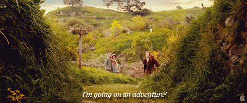

Ahoj Toníku,
Chtěl bych udělat krok zpátky a začít společně tvořit jinou hru, která se lépe hodí k pochopení programování a díky níž do toho nebudeme plést složité věci jako středoškolskou matematiku, práci v Godotu a další činosti potřebné k vytvoření 3D hry.

Budeme tedy tvořit textovou adventuru - první hru, které na počítačích vznikla. Zajímavé na tom bude, že si můžeš celý herní svět vymyslet úplně sám a stvořit tak něco unikátního. A pokud se nám to povede, budeš se moct pochlubit kamarádům a rodině.

Tato stránka [GitHub](https://github.com/Esosek/Tonik_text_adventura) ti bude sloužit jako učebnice, najdeš tady vše, co se naučíme a hru v rozpracovaném stavu. Na hodině ti ukážu, jak s tím pracovat, Ve složce [dokumentace](./dokumentace) najdeš soubory k různým tématům (například [proměnné](./dokumentace/promenne.md)), které ti pomohou lépe pochopit, jak programování funguje a budeš se k nim moct vracet v případě, že by sis nevěděl rady.

Novou hru budeme psát v jazyce **Python** a ke spuštění budeme používate příkazový řádek. V souboru [instalace](./dokumentace/instalace.md) najdeš postup, jak si u sebe na počítači nainstalovat programovací jazyk a vývojářeské prostředí, kde budeme programovat.

Snad tě to bude bavit a budu se těšit na naše setkání.
